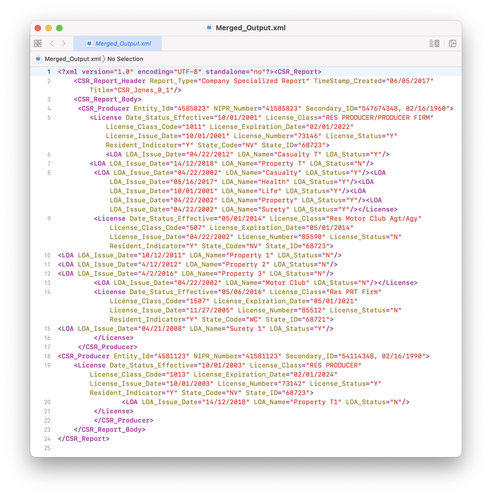
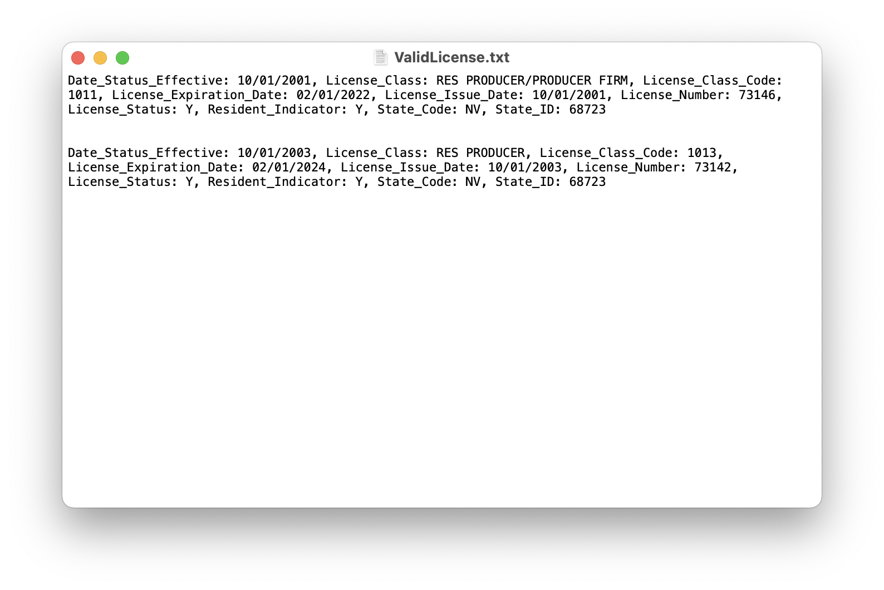
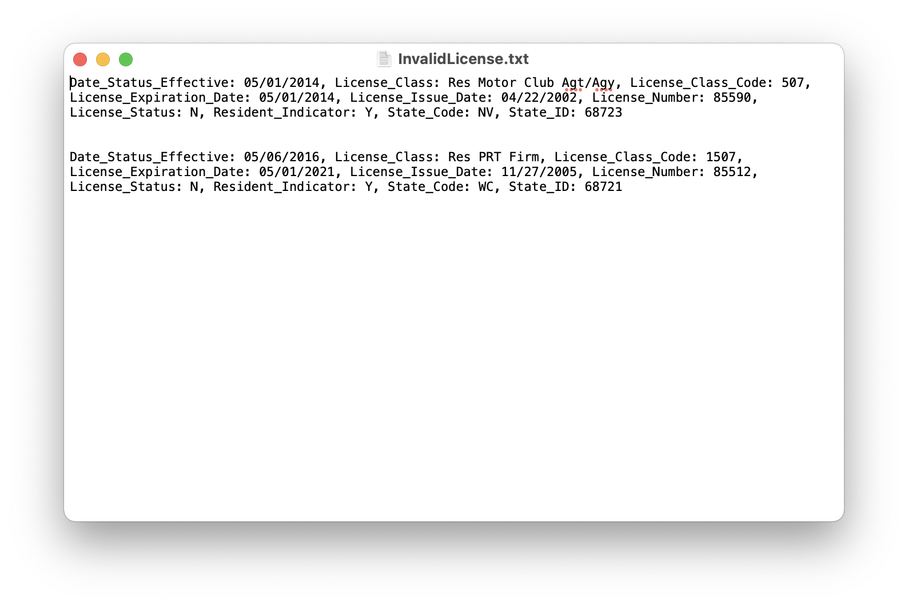

# Java Advanced - Assignment - Afternoon

### Assignment2 folder containts the solutions for assignment.

### Navigate to ./Assignment2/src/com/assignment2/Q1.java for the solution for merging of two xml filed based on the given keys (NIPR_Number,StateCode, licenseNumber,EffectiveDate).

1. The xml files given in the question are license1.xml and license2.xml. They can be found inside the root folder 
 (assignment2).
 2. The output of the two merged files is present inside Merged_Output.xml file present in the root folder as well. 
 ### Screenshot
 
 - This shows the merged output of the two xml files.
 

    
 

 
### Navigate to ./Assignment2/src/com/assignment2/Q2.java for the solution for valid and invalid licenses.
1. The valid and invalid licenses and all of there details are stored inside the text files ValidLicense.txt and InvalidLicense.txt respectively.
### Screenshots
- This shows the two valid and invalid files with license details.

    
   

