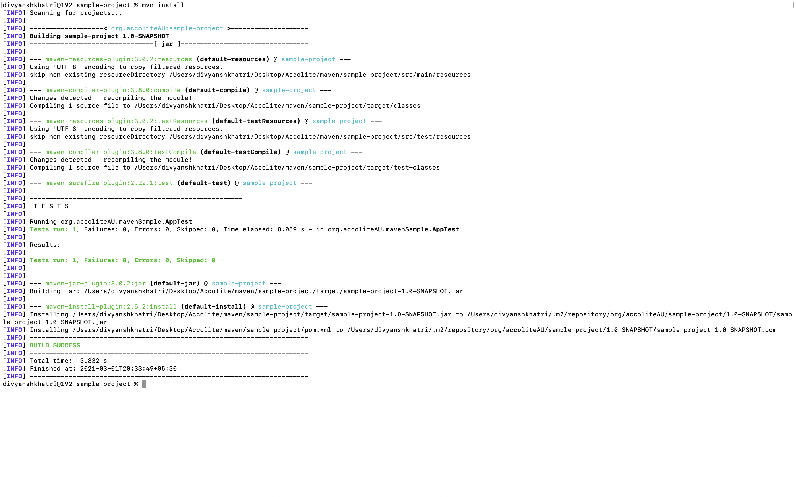
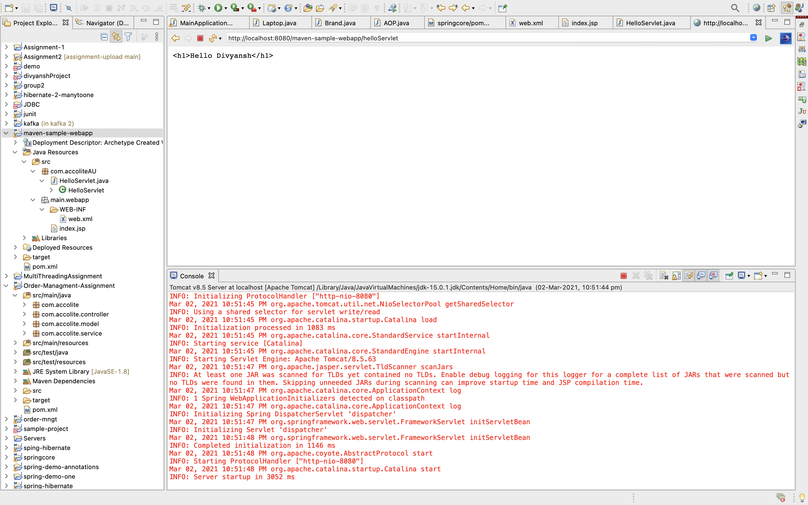

# Maven Basics, Web/App Server Basics

## Project 1 - sample-project

1. To Create a basic maven project, run the command - 

```
mvn archetype:generate -DgroupId=orgaccoliteAU \                                                                 -DartifactId=sample-project \
-Dpackage=org.accoliteAU.maven-sample \
-Dversion=1.0-SNAPSHOT

```

- The -D means define a property of the given name, which is very generic. Almost everything can be handled and configured by it.

- Here the DgroupId contains the group id for the peojct. groupId is the namespace in which your projects live.  

- The Dartifact contains the artifact id for the project. It is the project name itself. When we build a .jar file, the resulting file will have this name.

- The Dversion contains the version of the project. 

<div>
    
    
</div>

2. cd into the sample-project folder using the command - 

``` 
cd sample-project

```

3. Run the command -

```
mvn install

```

<div>
    
</div>

- mvn install is used to automatically install the project's main artifact (the JAR, WAR or EAR), its POM and any attached artifacts (sources, javadoc, etc) produced.

### Project 2 - maven-sample-webapp

1. Run the following command to create the sample web-app using maven - 

```
mvn archetype:generate 
-DarchetypeGroupId=org.apache.maven.archetypes -DarchetypeArtifactId=maven-archetype-webapp -DarchetypeVersion=1.4

```

<div>
    
</div>


- Here, maven-archetype-webapp is an archetype which generates a sample Maven webapp project.


2. After creating the sample maven-project, go to the project explorer and right click on src. Click on the build path option and select 'Use as Source Folder'.

3. After that, create a new Servlet.

4. Add your basic code to the template. Connect your jsp file to the servlet.

5. Run the web-app java project using the command - 

``` 
mvn tomcat7:run

```

<div>
    
    
</div>

