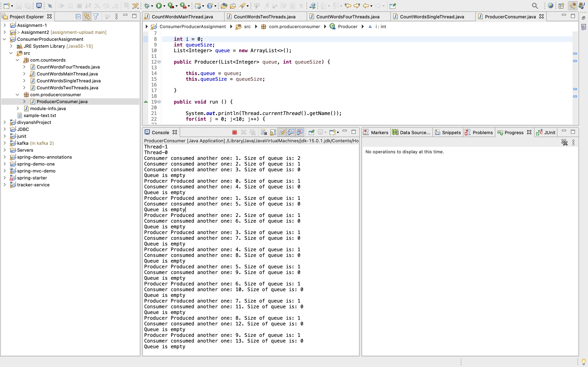
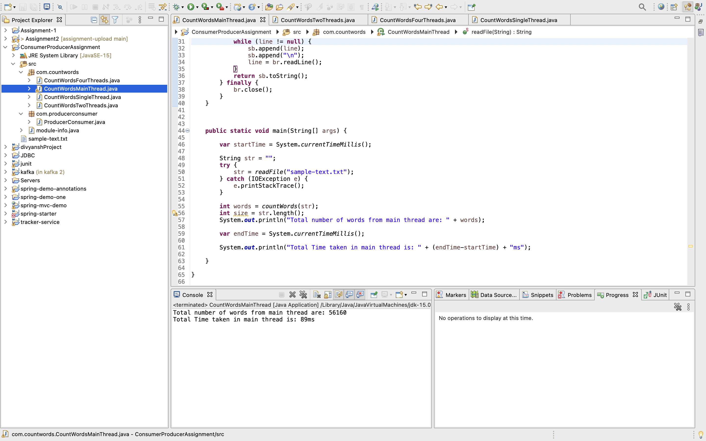
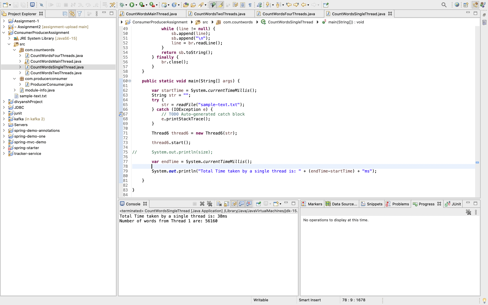
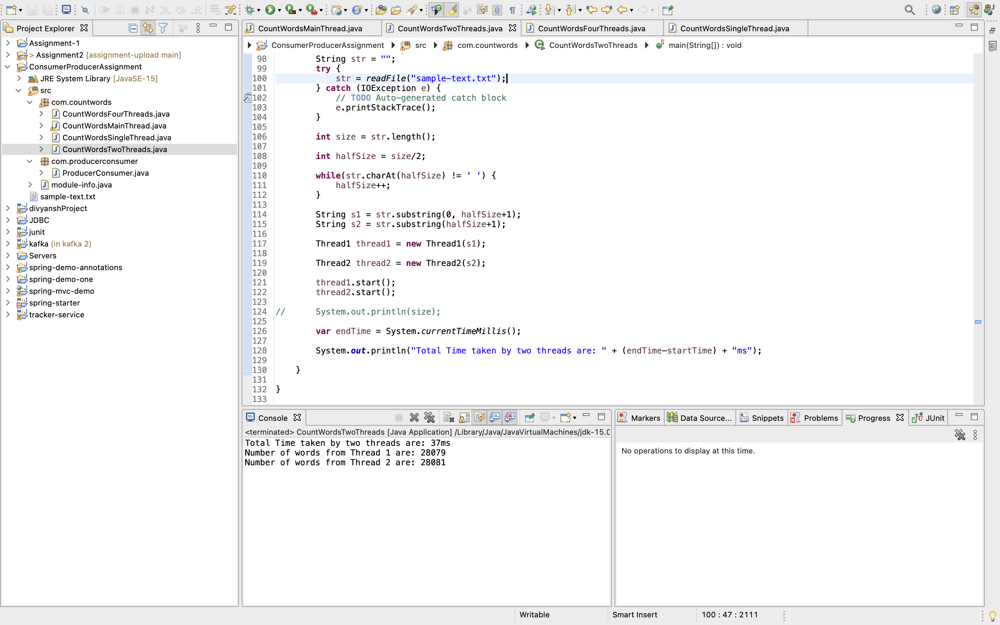
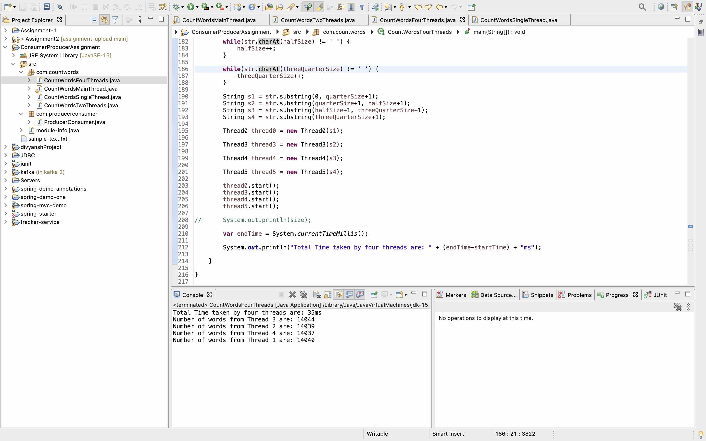

# Java Multithreading Assignment - Morning

## Screenshots

- Q1. Write a Multi threaded program to demonstrate Producer and Consumer who share a common queues of similar items.
The Role of the Producer is to generate the item and place it in the queue and make
sure he doesn't generate when the queue is full
The Role of the Consumer is to remove the item from the queue and consume it and
make sure he doesn't consume when the queue is empty
Take a few items in the queue initially instead of an empty queue.

- Screenshot

    

-Q2. Take a List of lines (String) with dummy data and count the total words of all the lines and
check the time taken to perform the task using threads and without threads.
Change the no of threads, no of lines and give a report/summary.

- Screenshot

    

    

    

    

