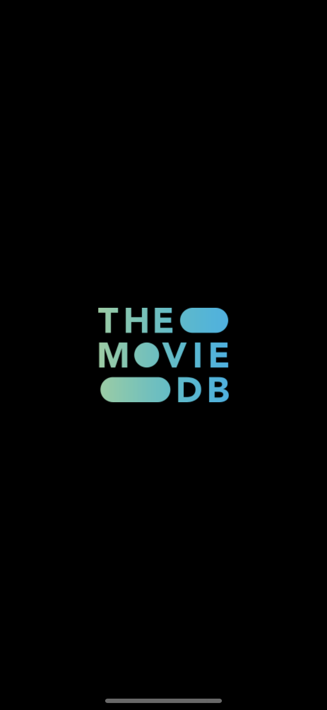
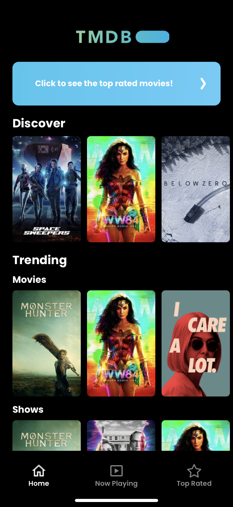
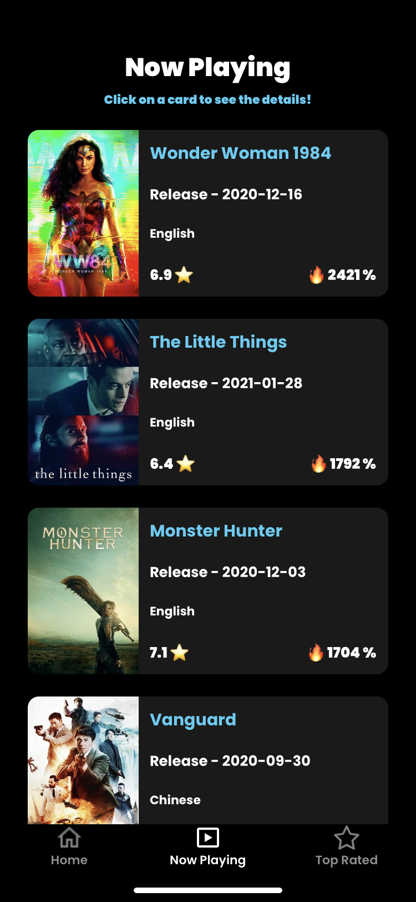
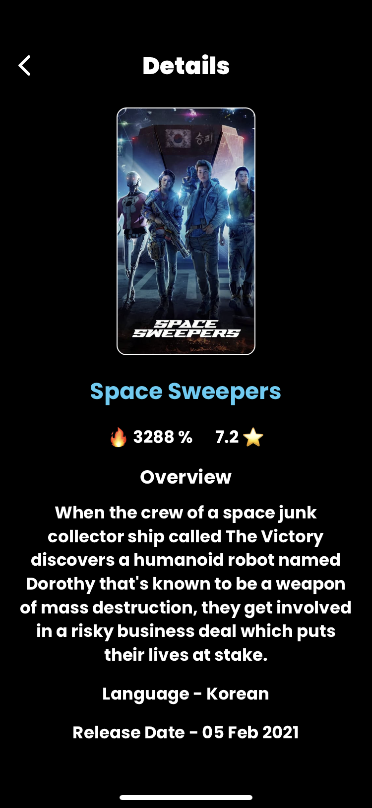

# TMDB React-Native Application

## Screenshots and Demonstration Video

__________________________________________________________________________________________________________________________________________________

## Prerequisites

The client project has dependencies that require **Node and NPM**.

__________________________________________________________________________________________________________________________________________________

## Installation

### Getting Started

Install [Node.js](https://nodejs.org)  and [npm](https://www.npmjs.com/)

### Install Dependencies

npm install (This will create the node_modules folder)

### Installation Steps

1. Setup the sdk-location if working on windows.

2. Run react-native run-android from your command prompt or terminal if working on windows or run the command react-native run-ios if working on mac.
