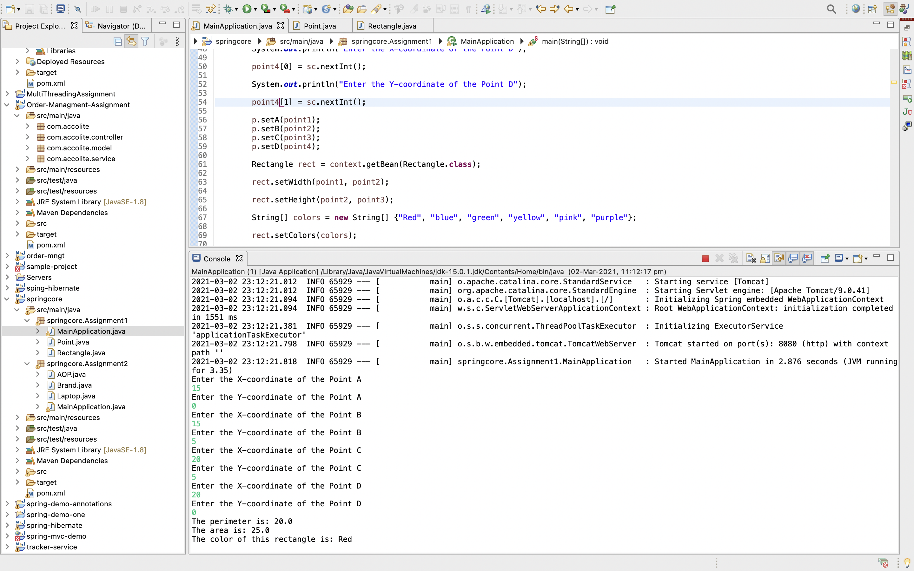
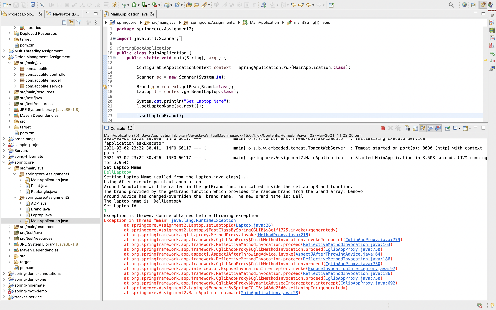

# Spring Core, AOP Morning Session

## Project 1  Creating a spring-core project with Rectangle and Point Class.

1. The Point class has 4 variables which assign the value to the 4 coordinates of the rectangle namely a, b, c, d.

2. This Point class object is autowired inside the Rectangle Class which creates a Point bean.
After creating a Point Class bean, there is no need for instantiating the Point Class and all its data members and variables can be used directly by the Recatangle. 

```
@Autowired
@Qualifier("point")
Point p;
```

### Bonus

- There is a 'color' list which is initialized with a few colors. 
This color list is passed to the 'color list' in the object of the Reactangle class using the getColors() function.

- The color is then randomly chosen from the list of colors and assigned to the rectangle. Also, the color of the rectangle is then printed in the logs.

<div>


## Project 2  Create aspect using After, AfterReturning, AfterThrowing, Around advices in AOP. Also using the pointcut types within, args also along with execution.

1. The project 2 (mentioned as assignment-2 in the project) contains 2 classes, Laptop and Brand.

2. The Laptop contains the details of the laptop and the brand name and it's rank.
The brand name and brand rank of the laptop are calculated using the Brand Class. The values are randomly provided by the Brand Class.

3. The Class AOP.java contains all the different aspects and the pointcuts used.

<div>

</div>

- The @After aspect runs exactly after the getLaptopName method.

- @Around annotation here is used to change the name of the brand of the laptop while the getBrand function is called in the setLaptopBrand method.

- @AfterThrowing aspect method run after the method (setLaptopId) exits by throwing an exception.

