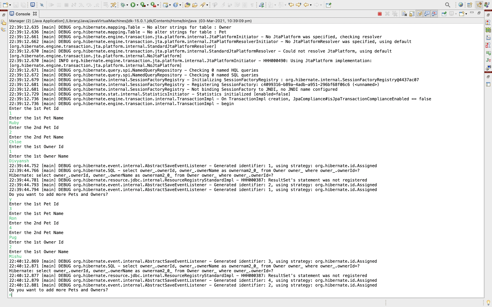

# Spring Hibernate - Afternoon Session

## Note
1. All the folders apart from the manytoone folder contain the code for Product, Category, Supplier Application.
2. Also, inside the spring-hibernate folder, navigate to src/main/java/com/accoliteAU/manytomany to find the solution for 2nd question in the assignment where we have to find the error in the code.

- Question 1 screenshots

    
    

- Q2 screenshots

    

- Q3 screenshots

    
    

- Q4 extra practiced queries 

Extra queries practiced are present inside hibernate-2-manytoone/src/main/java/com/accoliteAU/utils/Manager1.java

