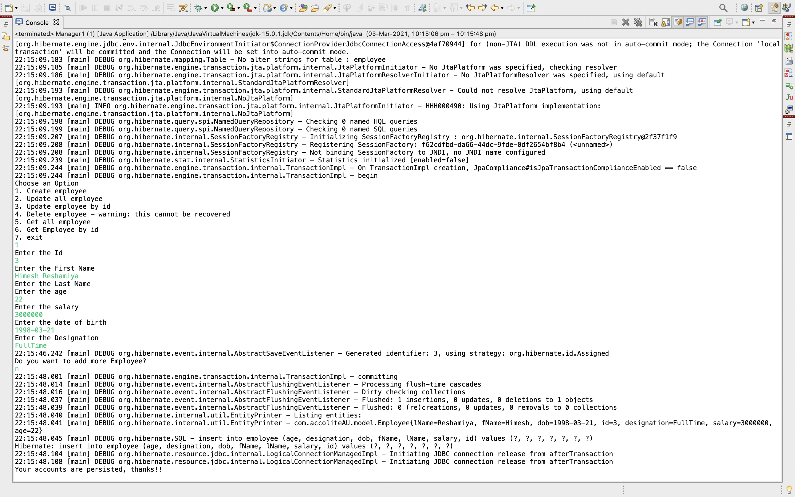
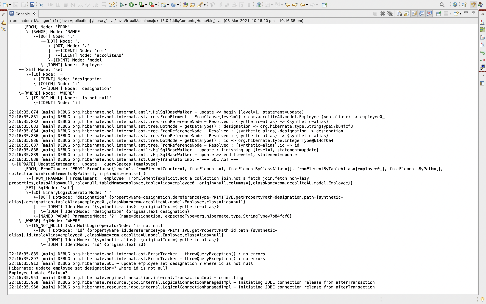
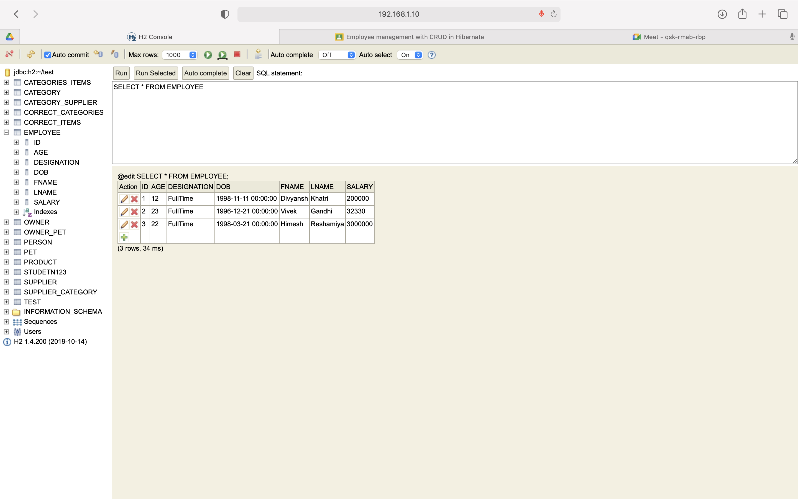
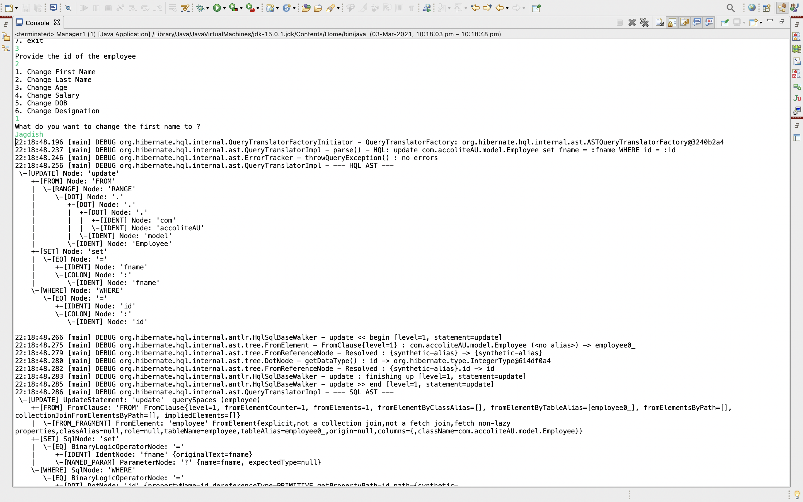
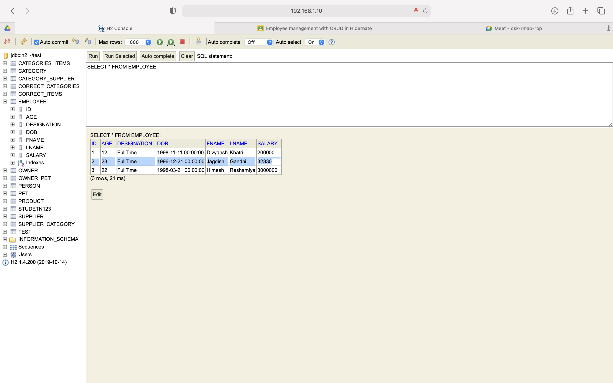
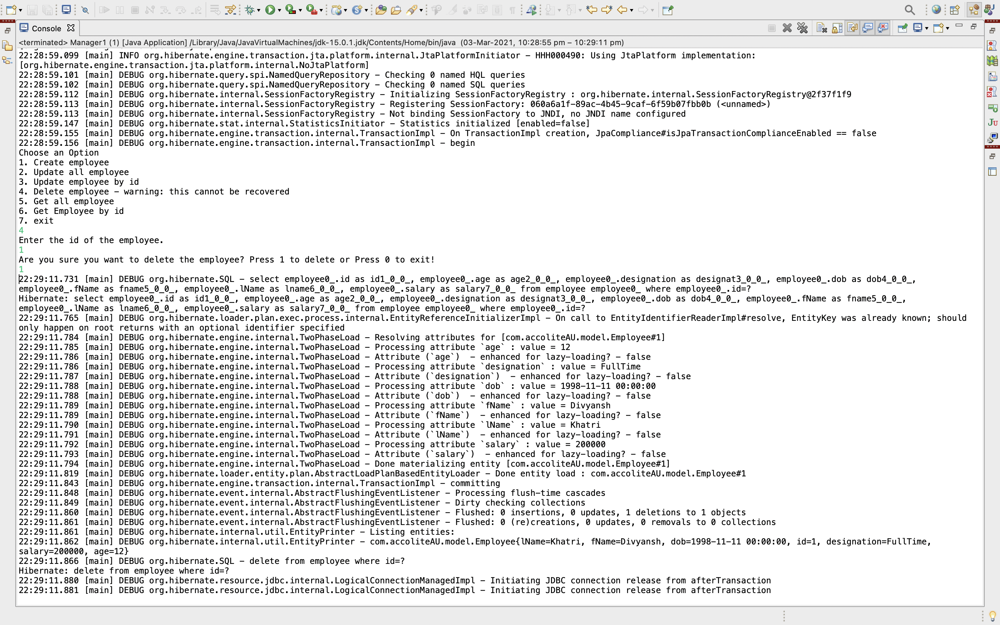
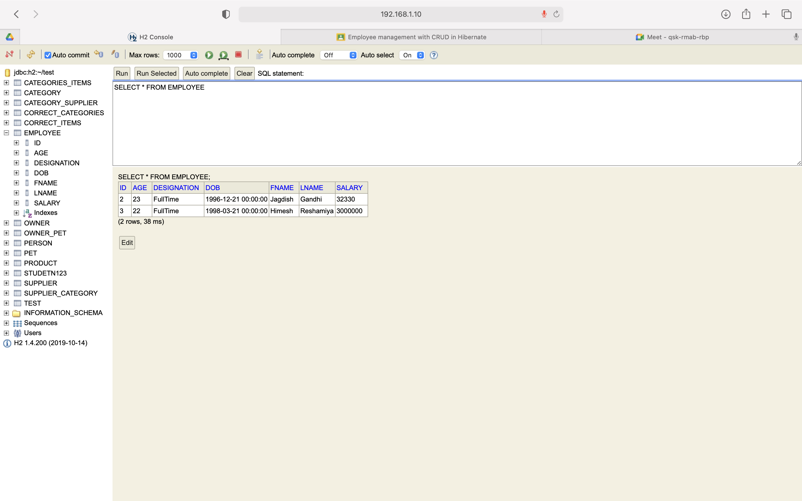
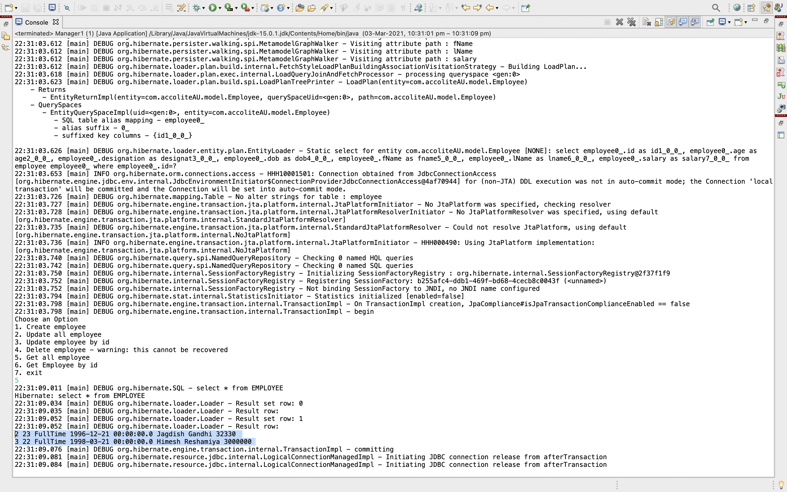
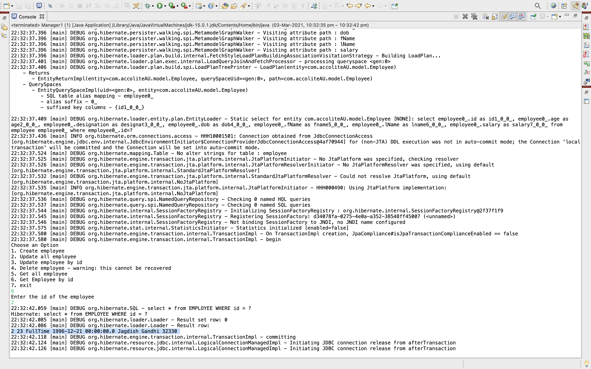

# Spring Hibernate Morning Session

1. Create employee

    

2. Update all employees

    
    

3. Update Employee by Id

    
    

4.  Delete employee - warning: this cannot be recovered

    
    

5. Get all employees

    

6. Get Employee by id

    

