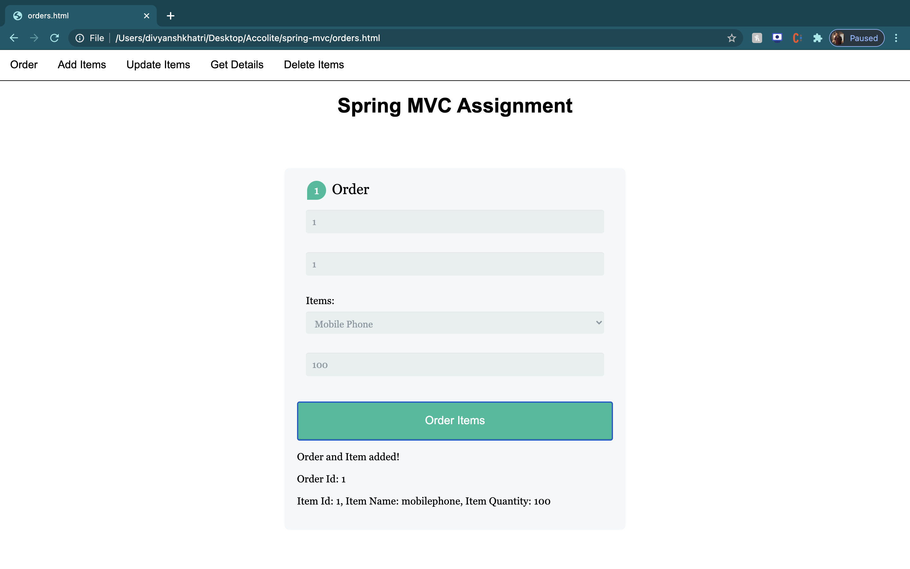
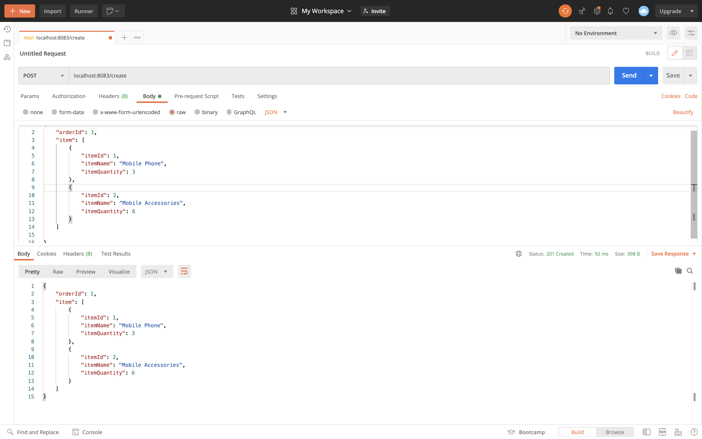
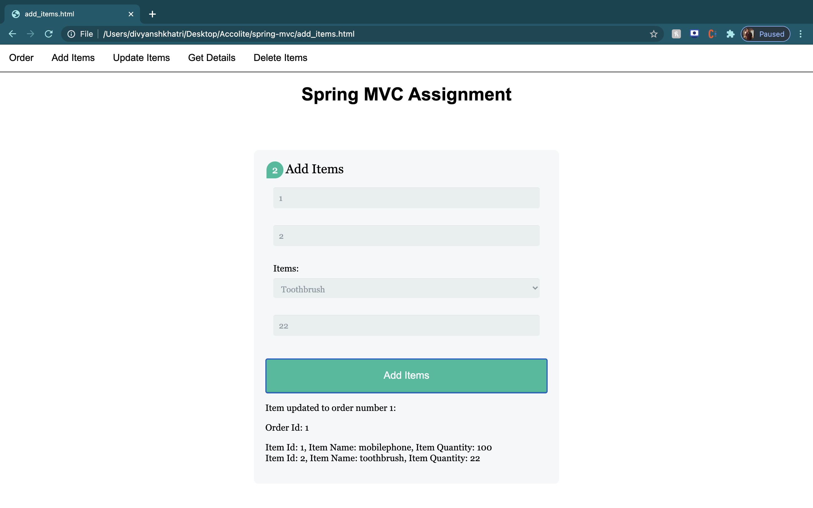
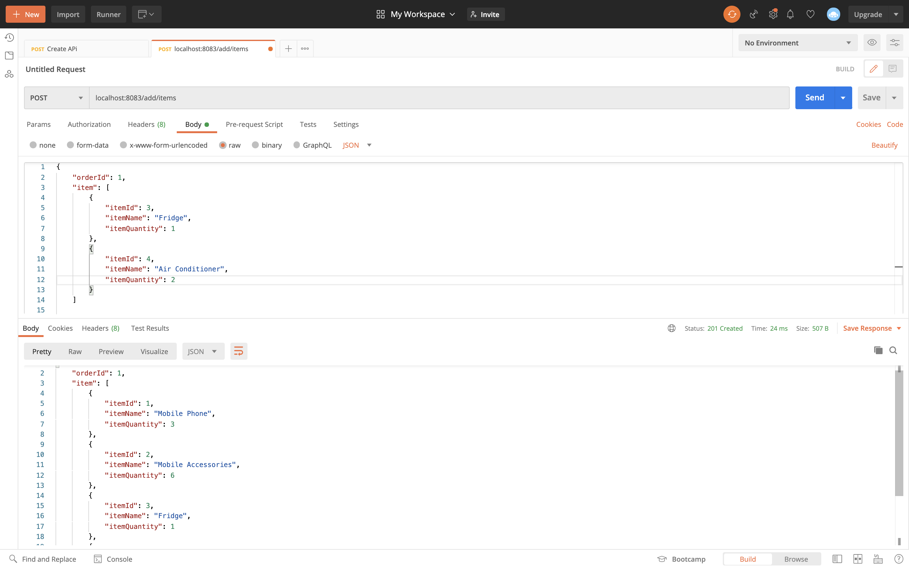
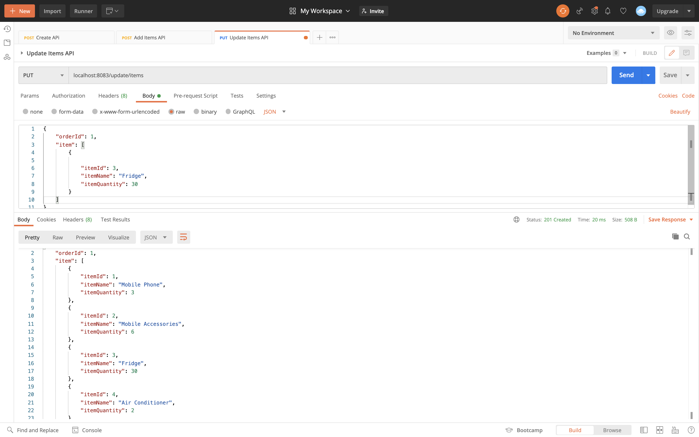
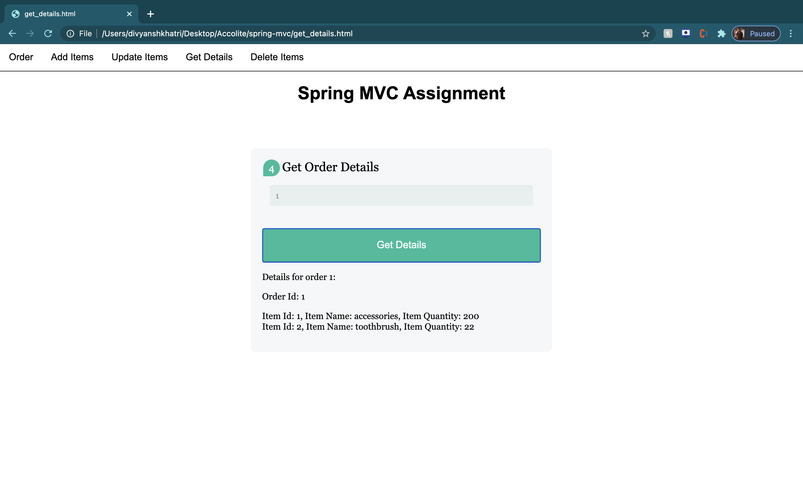
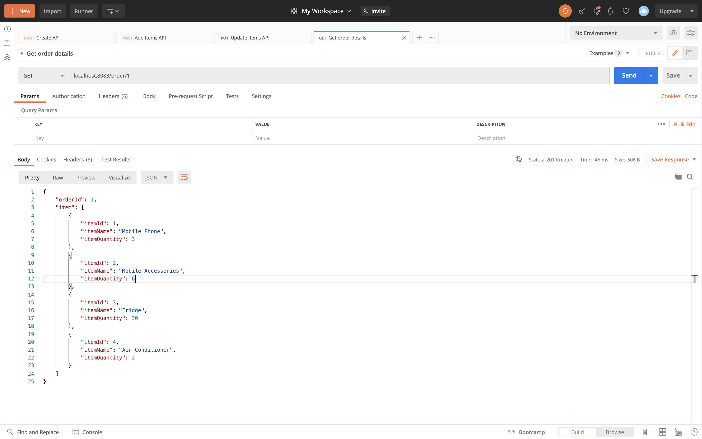
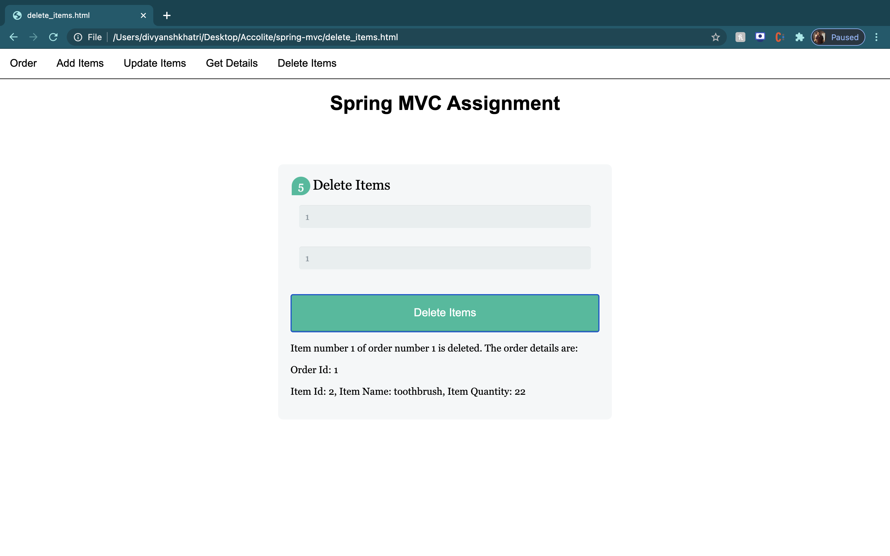
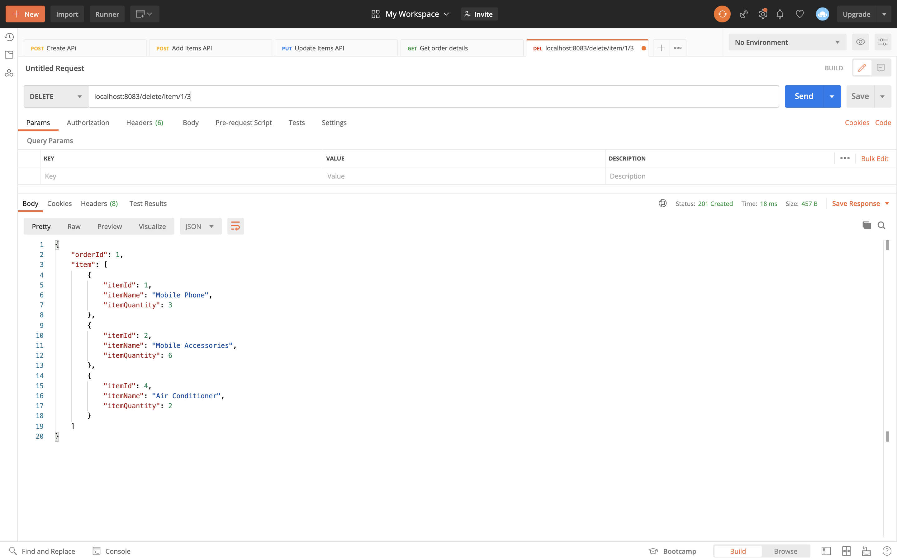

# Spring MVC - Evening Session

1. Create Order

- Create Order Webpage

    

- Create Order Postman API Call

    

2. Add Items

- Add Items Webpage

    

- Add Items Postman API Call

    

3. Update an Item

- Update Item Webpage

    

- Update Item Postman API Call

    

4. Get all items

- Get all items of an Order Webpage

    

- Get all items of an Order Postman API Call

    

5. Delete an item

- Delete item from an Order Webpage

    

- Delete item from an Order Postman API Call

    

