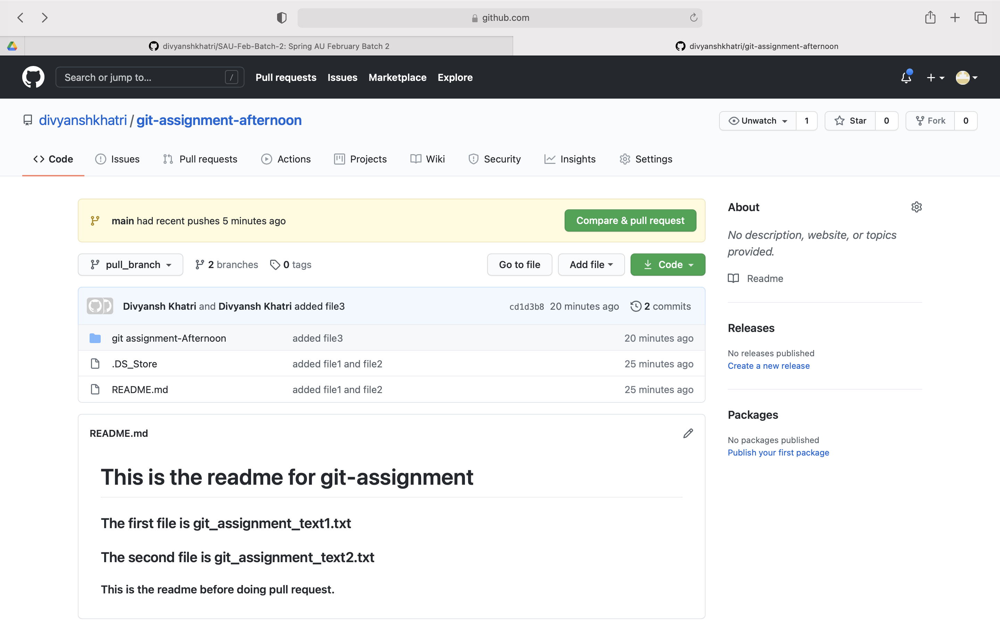

## The link for the assignment repo - https://github.com/divyanshkhatri/git-assignment-afternoon/

### The steps followed to create the new repo are - 

1. Initialize git using the command 

```
git init
```

2. To add the files to the local repository, use the command 

```
git add .
```

3. To commit the files, use the command 

```
git commit -m "Added file1 and file2"
```

4. Create a new branch and switch to that branch

```
git checkout -b "pull_branch"
```

5. Push the files to the github branch pull_branch

```
git push -u origin pull_branch 
```

6. Go to the github repo and click on Compare and Pull request



7. After giving the title and comment, click on create pull request.

8. Verify the pull request on the next page and the pull request is successfully issued from pull_branch to main branch.

9. To add any change to the main branch, switch to the main branch first using the command, 

```
git checkout -b main
```

10. To make sure that the changes in local repository and remore repository are same, do a pull request using the command 

```
git pull origin main
```

11. Now, add files to the main repository and push those changes to the main branch, using the commands 

```
git add .
git commit -m "added changes to main branch"
git push
```